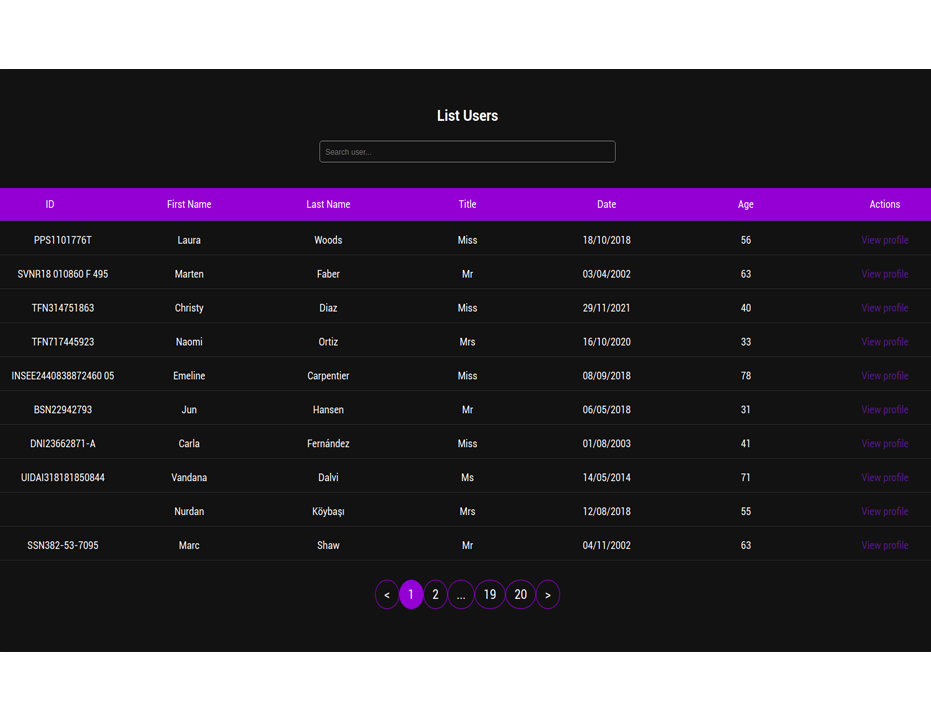
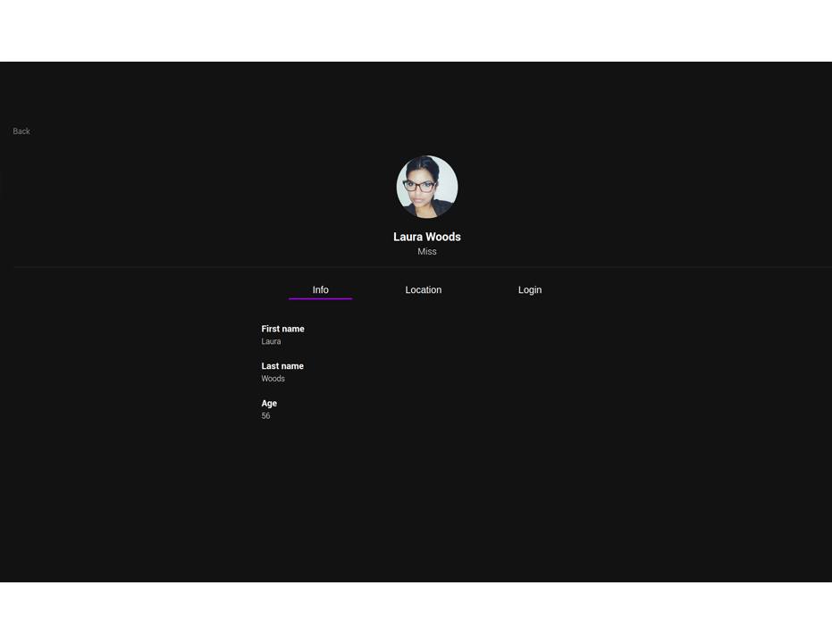

# User List project

Constuido em React + TypeScript + SCSS. Buscando informacoes em API.

Para rodar o projeto siga os seguintes passos:

- git clone git@github.com:cesconettoedu/User_List.git
- cd User_List
- npm install
- npm run dev

Os aprendizados e dificuldades durante o projeto:

- Aprendi a começar trabalhar com Typescript, até então só usava Javascript.

- A estruturar o React Router 6 e usá-lo de uma maneira mais correta, porque eu fazia da maneira antiga e mudou um pouco.

- Usar o SASS, tinha visto a muito tempo mas só usava Bootstrap (ajustando com CSS).

- Lembrar que antes de começar um projeto tem que planeja-lo estruturalmente.

